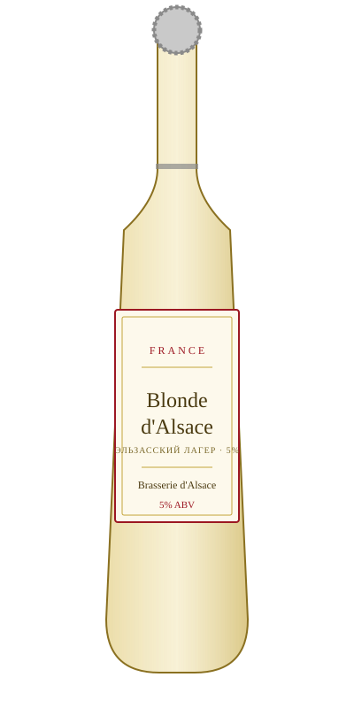

# Blonde d'Alsace — Brasserie d'Alsace

<figure markdown>
  { width="280" }
</figure>

## Общая информация

| | |
|---|---|
| **Страна** | Франция |
| **Регион** | Эльзас |
| **Стиль** | Лагер эльзасского типа |
| **Крепость** | 5% ABV |
| **Цвет** | Светло-золотистый |
| **Бокал** | Стандартный пивной бокал |
| **Температура подачи** | 5–7 °C |

## Описание

Эльзас исторически граничит с Германией, и местное пивоварение сильно на неё похоже: чистый, лёгкий лагер с умеренной хмелевой горечью и мягким солодовым телом. Хорошо освежает, простой и питкий стиль.

## Гастрономические пары

- Тарт фламбе (Flammkuchen)
- Квашеная капуста с колбасками (Choucroute)
- Лёгкие закуски

!!! tip "Для сотрудников"
    Эльзас — единственный крупный пивоваренный регион Франции с немецкими корнями (по историческим причинам регион неоднократно переходил между Францией и Германией). Хороший факт для гостей, удивляющихся, что во Франции вообще варят хорошее пиво.
