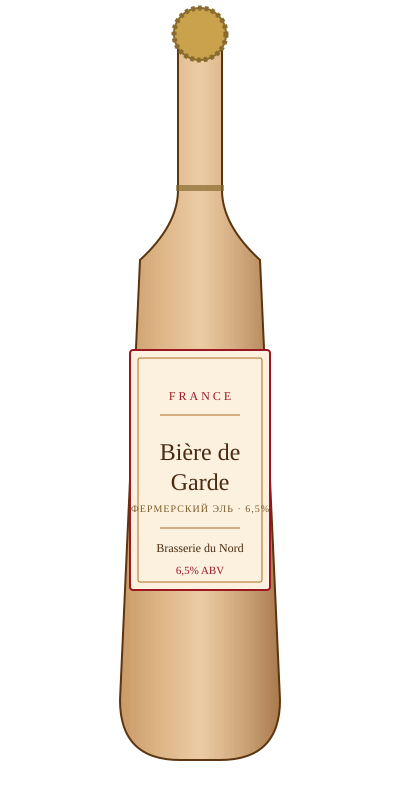

# Bière de Garde — Brasserie du Nord

<figure markdown>
  { width="280" }
</figure>

## Общая информация

| | |
|---|---|
| **Страна** | Франция |
| **Регион** | О-де-Франс (Nord-Pas-de-Calais) |
| **Стиль** | Bière de Garde |
| **Крепость** | 6,5% ABV |
| **Цвет** | Янтарный |
| **Бокал** | Бокал-тюльпан |
| **Температура подачи** | 10–12 °C |

## Описание

Исторический фермерский стиль севера Франции — пиво варили зимой и весной и выдерживали ("garde" — хранение) до летних полевых работ, когда пивоварение приостанавливали. Солодовый, слегка карамельный вкус, мягкая горечь, тона сухофруктов.

## Гастрономические пары

- Паштеты, шарктерия
- Блюда из дичи
- Сыры с плесенью

!!! tip "Для сотрудников"
    Стиль исторически ближе к элям северной Франции и Бельгии, чем к типично немецким или чешским лагерам — хороший пример того, что французское пивоварение имеет собственную давнюю традицию, а не только заимствования.
