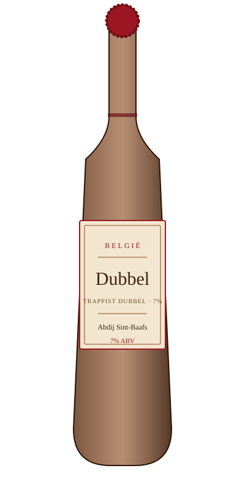

# Dubbel — Abdij Sint-Baafs

<figure markdown>
  { width="280" }
</figure>

## Общая информация

| | |
|---|---|
| **Страна** | Бельгия |
| **Стиль** | Trappist Dubbel |
| **Крепость** | 7% ABV |
| **Цвет** | Тёмно-коричневый, рубиновые отблески |
| **Бокал** | Кубок (chalice) или тюльпан |
| **Температура подачи** | 10–12 °C |

## Описание

Классический бельгийский траппистский эль двойного брожения. Аромат тёмного изюма, чернослива, карамели, лёгкой пряности от бельгийских дрожжей. Вкус солодовый, округлый, с сухим финалом — сладость никогда не выходит на первый план.

## Гастрономические пары

- Тушёное мясо, дичь
- Твёрдые выдержанные сыры
- Шоколадные десерты

!!! tip "На заметку"
    «Трапписткое» — это не стиль, а статус: пиво варят монахи (или под их контролем) в одном из немногих сертифицированных аббатств. Многие «аббатские» пива на рынке просто лицензируют название и не имеют отношения к монастырю.
