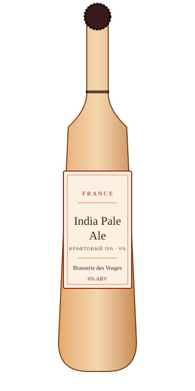

# India Pale Ale — Brasserie des Vosges

<figure markdown>
  { width="280" }
</figure>

## Общая информация

| | |
|---|---|
| **Страна** | Франция |
| **Регион** | Вогезы |
| **Стиль** | India Pale Ale (крафтовый) |
| **Крепость** | 6% ABV |
| **Цвет** | Янтарно-оранжевый |
| **Бокал** | Бокал-тюльпан |
| **Температура подачи** | 8–10 °C |

## Описание

Представитель молодой французской крафтовой сцены — стиль IPA, заимствованный из англо-американской традиции, но сваренный на местной воде и с частичным использованием французского хмеля. Выраженная хмелевая горечь, аромат цитрусовых и хвои, плотное тело.

## Гастрономические пары

- Острые блюда
- Бургеры
- Выдержанные сыры

!!! tip "Для сотрудников"
    Французская крафтовая сцена — довольно новое явление (в основном 2010-е годы), в отличие от многовековых традиций Бельгии и Германии. Стоит подавать это как "современную главу" пивной карты, а не историческую.
