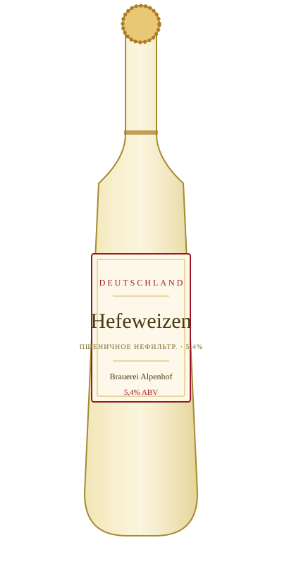

# Hefeweizen — Brauerei Alpenhof

<figure markdown>
  { width="280" }
</figure>

## Общая информация

| | |
|---|---|
| **Страна** | Германия |
| **Стиль** | Hefeweizen (баварское пшеничное) |
| **Крепость** | 5,4% ABV |
| **Цвет** | Мутный светло-золотистый |
| **Бокал** | Высокий weizen-бокал |
| **Температура подачи** | 6–8 °C |

## Описание

Баварское нефильтрованное пшеничное пиво. Характерный аромат банана и гвоздики — результат работы специальных пшеничных дрожжей, а не добавок. Лёгкая текстура, невысокая горечь, освежающая кислинка.

## Гастрономические пары

- Белые колбаски (Weisswurst), закуски
- Лёгкие салаты
- Десерты на основе яблок

!!! tip "Для сотрудников"
    Банановый и гвоздичный аромат — не добавка, а продукт брожения специфическими дрожжами (Weihenstephan-штаммы и похожие). Хороший факт, чтобы объяснить гостям, которые уверены, что в пиво что-то "добавили".
