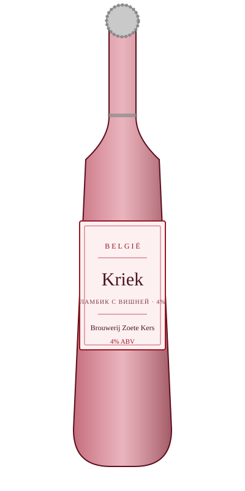

# Kriek — Brouwerij Zoete Kers

<figure markdown>
  { width="280" }
</figure>

## Общая информация

| | |
|---|---|
| **Страна** | Бельгия |
| **Стиль** | Lambic Kriek (пиво на вишне) |
| **Крепость** | 4% ABV |
| **Цвет** | Тёмно-розовый, рубиновый |
| **Бокал** | Тюльпан или флюте |
| **Температура подачи** | 6–8 °C |

## Описание

Ламбик — пиво спонтанного брожения (без добавления культивированных дрожжей, брожение идёт от диких дрожжей в воздухе региона Пайоттенланд), настоянное на вишне. Кисло-сладкий вкус, с выраженной кислинкой ламбика и ароматом свежей вишни — совсем не похоже на обычное пиво.

## Гастрономические пары

- Шоколадные десерты
- Мягкие сыры
- Фруктовые тарты

!!! tip "Для сотрудников"
    Гостям, которые "не любят пиво", часто нравится крик — из-за кислинки и ягодного вкуса он воспринимается ближе к сидру или фруктовому вину. Хороший вариант для знакомства с более сложными пивными стилями.
