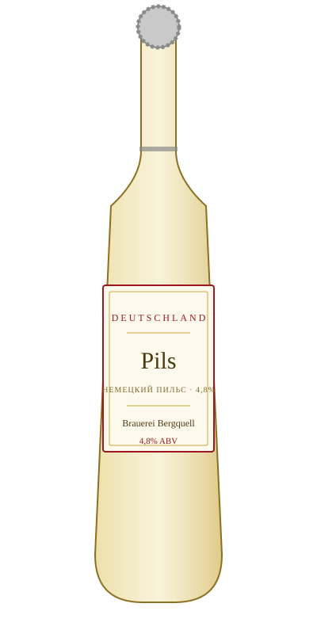

# Pils — Brauerei Bergquell

<figure markdown>
  { width="280" }
</figure>

## Общая информация

| | |
|---|---|
| **Страна** | Германия |
| **Стиль** | German Pils |
| **Крепость** | 4,8% ABV |
| **Цвет** | Светло-золотистый |
| **Бокал** | Узкий пильснер-бокал |
| **Температура подачи** | 5–7 °C |

## Описание

Немецкий пильзнер — более сухой и хмелевой, чем чешский прародитель стиля. Чёткая хмелевая горечь, хрустящий, чистый вкус, плотная белая пена. Один из самых технически "требовательных" стилей — недостатки пивоварения в нём хорошо заметны, поэтому качественный пильс всегда признак хорошей пивоварни.

## Гастрономические пары

- Жареные колбаски, шницель
- Лёгкие закуски
- Солёные снеки

!!! tip "На заметку"
    Правильная подача пильса — с классическим трёхэтапным наливом для плотной пенной шапки (на 2–3 захода, давая пене осесть). Это не просто ритуал — плотная пена защищает пиво от окисления и удерживает аромат хмеля.
