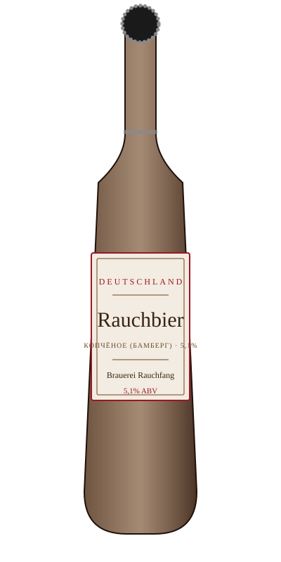

# Rauchbier — Brauerei Rauchfang

<figure markdown>
  { width="280" }
</figure>

## Общая информация

| | |
|---|---|
| **Страна** | Германия |
| **Стиль** | Rauchbier (копчёное пиво, Бамберг) |
| **Крепость** | 5,1% ABV |
| **Цвет** | Тёмно-янтарный, почти коричневый |
| **Бокал** | Кружка Зайдель |
| **Температура подачи** | 9–11 °C |

## Описание

Историческая специализация города Бамберг (Франкония): солод коптят на буковых дровах перед варкой, что даёт пиву выраженный дымный аромат — напоминает копчёный бекон или костёр. Вкус плотный, солодовый, с долгим дымным послевкусием.

## Гастрономические пары

- Копчёности, барбекю
- Жирные мясные блюда
- Твёрдые сыры с выраженным вкусом

!!! tip "На заметку"
    Дымный вкус — самый "спорный" среди наших позиций: гостям стоит предлагать его с предупреждением, что вкус нестандартный, либо давать попробовать маленькую порцию перед полным заказом.

**Из меню:**

- [Рибай на кости](../menu/mains.md)
