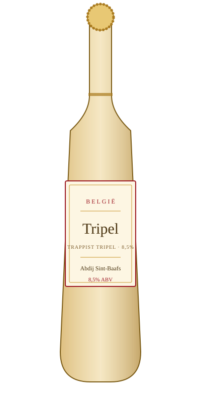

# Tripel — Abdij Sint-Baafs

<figure markdown>
  { width="280" }
</figure>

## Общая информация

| | |
|---|---|
| **Страна** | Бельгия |
| **Стиль** | Trappist Tripel |
| **Крепость** | 8,5% ABV |
| **Цвет** | Золотистый |
| **Бокал** | Кубок (chalice) или тюльпан |
| **Температура подачи** | 8–10 °C |

## Описание

Более крепкий и светлый родственник дубеля. Аромат банана, гвоздики, мёда и лёгкого хмелевого перца. Несмотря на высокую крепость, пьётся легко — хорошо ощутима работа бельгийских дрожжей, которые дают сложный фруктово-пряный профиль.

## Гастрономические пары

- Жареная курица, блюда с карри
- Мягкие сыры
- Фруктовые десерты

!!! tip "На заметку"
    Высокая крепость (8–9%) при лёгком, "питком" вкусе — частая ловушка для гостей. Стоит мягко предупреждать о крепости, особенно если гость сравнивает трипель с обычным лагером по ощущениям.
