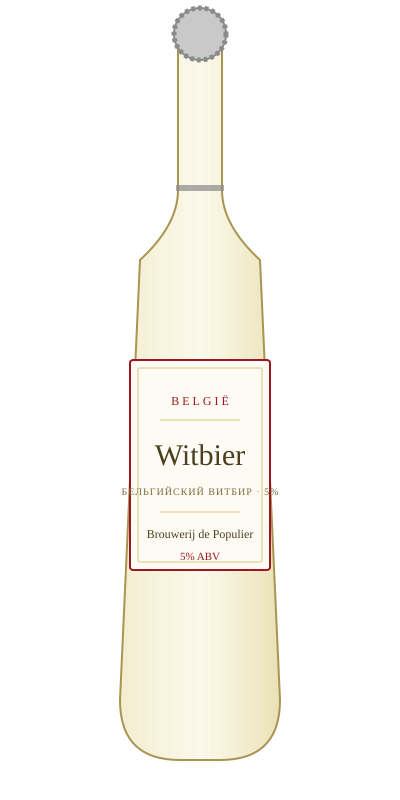

# Witbier — Brouwerij de Populier

<figure markdown>
  { width="280" }
</figure>

## Общая информация

| | |
|---|---|
| **Страна** | Бельгия |
| **Стиль** | Belgian Witbier |
| **Крепость** | 5% ABV |
| **Цвет** | Бледно-жёлтый, мутный (нефильтрованное) |
| **Бокал** | Высокий бокал (weizen-стакан) |
| **Температура подачи** | 4–6 °C |

## Описание

Нефильтрованное пшеничное пиво, сваренное с добавлением кориандра и сушёной цедры апельсина — классическая бельгийская пряная рецептура. Лёгкое, освежающее, с мягкой кислинкой и цитрусовым ароматом.

## Гастрономические пары

- Морепродукты, мидии
- Лёгкие салаты
- Блюда с цитрусовыми соусами

!!! tip "Для сотрудников"
    Мутность бокала — не брак, а особенность стиля: пиво не фильтруют, чтобы сохранить пшеничный белок и дрожжевой осадок, которые дают характерную текстуру и аромат.
