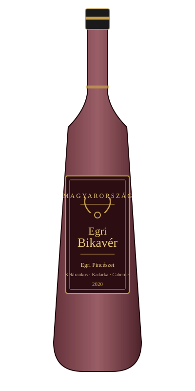

# База знаний винного магазина

Добро пожаловать! Это учебные материалы для сотрудников: сорта, регионы, подача и сервировка вина.

!!! info "Инструкция для владельца — как смотреть демо"
    Это черновая версия сайта, чтобы оценить внешний вид и структуру.

    1. Откройте вкладку **«Вина»** в верхнем меню — там собраны три примера страниц по винам.
    2. Нажмите на любое вино в списке ниже, чтобы увидеть, как выглядит карточка: описание, таблица характеристик, картинка этикетки, гастрономические пары.
    3. Попробуйте **поиск** (значок лупы вверху страницы) — введите, например, «Шабли» или «купаж» и посмотрите, как MkDocs находит совпадения прямо по тексту страниц.
    4. Весь сайт собирается из обычных файлов Markdown — добавить новое вино или раздел так же просто, как написать текстовый файл.
    5. Если понравится структура — дальше добавим пароль на вход и настроим автопубликацию на GitHub Pages при каждом изменении.

## Вина

- { width="120" }

    **Chablis**
    Франция · белое

    [Подробнее →](wines/chablis.md)

- { width="120" }

    **Soave Classico**
    Италия · белое

    [Подробнее →](wines/soave.md)

- { width="120" }

    **Egri Bikavér**
    Венгрия · красное

    [Подробнее →](wines/bikaver.md)

