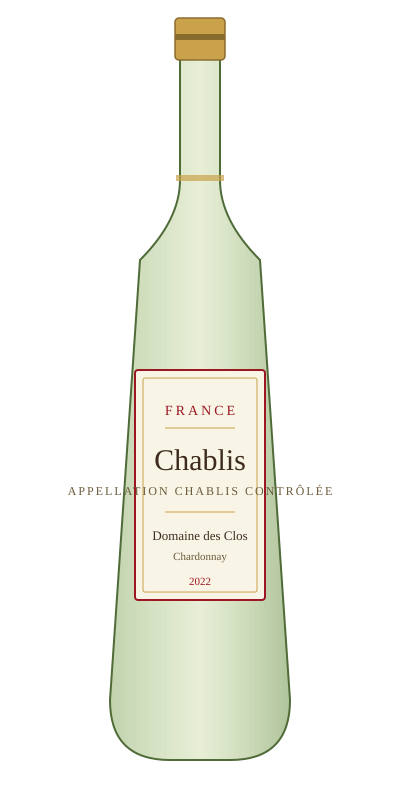

# Chablis — Domaine des Clos

<figure markdown>
  { width="280" }
</figure>

## Общая информация

| | |
|---|---|
| **Страна** | Франция |
| **Регион** | Бургундия, Шабли |
| **Апелласьон** | AOC Chablis |
| **Сорт винограда** | Шардоне (100%) |
| **Тип** | Белое, сухое |
| **Крепость** | 12,5% |
| **Температура подачи** | 10–12 °C |

## Описание

Классическое шабли с минеральностью, характерной для известняково-меловых почв Кимериджа. В аромате — цитрусовые, зелёное яблоко, лёгкие тона мокрого камня. Вкус свежий, с высокой кислотностью и длинным послевкусием без выраженной дубовой ноты — вино не выдерживается в новой бочке.

## Гастрономические пары

- Устрицы и морепродукты
- Козий сыр
- Рыба на пару, севиче

!!! tip "История"
    Шабли часто путают с обычным шардоне из Нового Света — объясняйте гостям, что стиль здесь совсем другой: без ванильных и сливочных нот от бочки, акцент на минеральность и кислотность.
