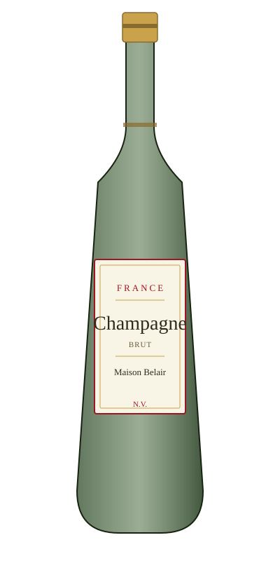

# Champagne Brut — Maison Belair

<figure markdown>
  { width="280" }
</figure>

## Общая информация

| | |
|---|---|
| **Страна** | Франция |
| **Регион** | Шампань |
| **Апелласьон** | AOC Champagne |
| **Сорт винограда** | Шардоне, Пино Нуар, Пино Менье (купаж) |
| **Тип** | Игристое, брют |
| **Крепость** | 12% |
| **Температура подачи** | 6–8 °C |

## Описание

Классический недорогой купаж без указания года (N.V. — non-vintage), собранный для стабильного фирменного стиля дома из года в год. Аромат яблока, цитрусовых, бриоши от выдержки на дрожжах. Пузырьки мелкие, стойкие.

## Гастрономические пары

- Аперитив
- Устрицы, морепродукты
- Лёгкие закуски, канапе

!!! tip "На заметку"
    Только вино из региона Шампань во Франции имеет право называться «шампанским» — это охраняемое географическое название. Игристые вина из других регионов (Креман, Просекко, Кава) называть шампанским некорректно, даже если гость сам так их называет.
