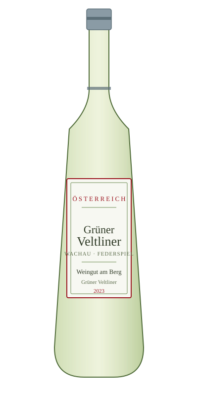

# Grüner Veltliner — Weingut am Berg

<figure markdown>
  { width="280" }
</figure>

## Общая информация

| | |
|---|---|
| **Страна** | Австрия |
| **Регион** | Вахау |
| **Уровень** | Federspiel |
| **Сорт винограда** | Грюнер Вельтлинер (100%) |
| **Тип** | Белое, сухое |
| **Крепость** | 12,5% |
| **Температура подачи** | 9–11 °C |

## Описание

Флагманский австрийский сорт: аромат белого перца, цитрусовых и зелёного яблока, часто с лёгкой миндальной нотой. Вкус свежий, пряный, с характерной "перечной" остротой в послевкусии — узнаваемая черта грюнера.

## Гастрономические пары

- Блюда азиатской кухни средней остроты
- Спаржа
- Лёгкие блюда из птицы

!!! tip "Для сотрудников"
    Пряная перечная нота грюнера хорошо работает там, где классический совиньон блан "теряется" — например, со спаржей, которую многие вина просто не выдерживают.
