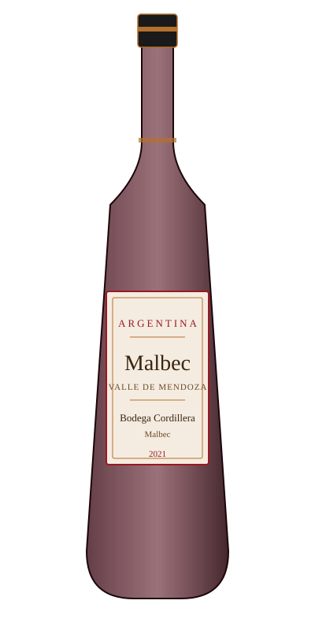

# Malbec — Bodega Cordillera

<figure markdown>
  { width="280" }
</figure>

## Общая информация

| | |
|---|---|
| **Страна** | Аргентина |
| **Регион** | Мендоса |
| **Сорт винограда** | Мальбек (100%) |
| **Тип** | Красное, сухое |
| **Крепость** | 14% |
| **Температура подачи** | 16–18 °C |

## Описание

Аргентинский мальбек с высокогорных виноградников Мендосы (600–1200 м над уровнем моря). Насыщенный тёмно-фиолетовый цвет, аромат сливы, ежевики, какао и лёгкой дымности. Танины плотные, но бархатистые, вкус сочный, с продолжительным послевкусием.

## Гастрономические пары

- Стейки на углях, барбекю
- Блюда с копчёностями
- Твёрдые сыры с выдержкой

!!! tip "На заметку"
    Мальбек изначально французский сорт (Каор), но именно в Аргентине он раскрылся по-новому благодаря высокогорному климату — большим перепадам температур день/ночь. Хороший факт для гостей, интересующихся происхождением вина.
