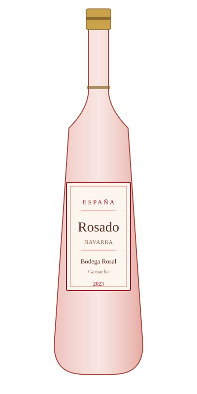

# Rosado de Navarra — Bodega Rosal

<figure markdown>
  { width="280" }
</figure>

## Общая информация

| | |
|---|---|
| **Страна** | Испания |
| **Регион** | Наварра |
| **Апелласьон** | DO Navarra |
| **Сорт винограда** | Гарнача (100%) |
| **Тип** | Розовое, сухое |
| **Крепость** | 13% |
| **Температура подачи** | 9–11 °C |

## Описание

Испанский розадо более насыщенного, "малинового" цвета, чем прованский стиль — Наварра исторически считается одним из лучших регионов Испании для розовых вин из гарначи. Аромат клубники и красной смородины, вкус сочный, с чуть большей телесностью, чем у французских розе.

## Гастрономические пары

- Тапас, паэлья
- Пряные средиземноморские блюда
- Лёгкие блюда из свинины на гриле

!!! tip "На заметку"
    Хороший пример для гостей, чтобы показать разницу стилей розе: французский прованский — бледный и лёгкий, испанский наваррский — более яркий по цвету и телу, при этом тоже полностью сухой.
