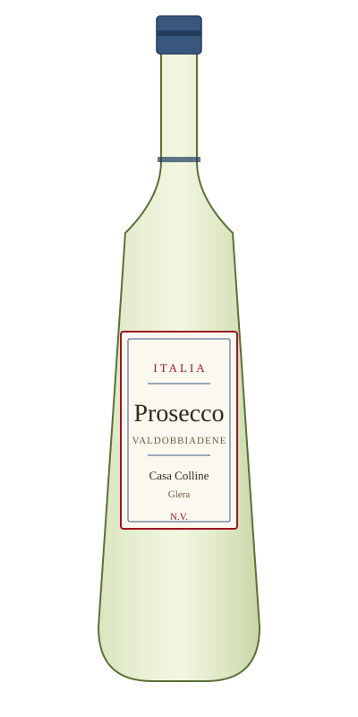

# Prosecco Valdobbiadene — Casa Colline

<figure markdown>
  { width="280" }
</figure>

## Общая информация

| | |
|---|---|
| **Страна** | Италия |
| **Регион** | Венето |
| **Апелласьон** | DOCG Conegliano Valdobbiadene |
| **Сорт винограда** | Глера (100%) |
| **Тип** | Игристое, экстра сухое |
| **Крепость** | 11% |
| **Температура подачи** | 6–8 °C |

## Описание

Итальянское игристое, произведённое методом Шарма (вторичное брожение в резервуарах, а не в бутылке, как у шампанского) — отсюда более лёгкий, фруктовый и менее "хлебный" стиль. Аромат зелёного яблока, груши, белых цветов. Пузырьки мягкие, менее агрессивные, чем у шампанского.

## Гастрономические пары

- Аперитив, лёгкие закуски
- Коктейль Aperol Spritz (на основе просекко)
- Фруктовые десерты

!!! tip "На заметку"
    DOCG на этикетке (высшая категория итальянской классификации) — признак вина из исторической зоны Конельяно-Вальдоббьядене, а не массового просекко из равнинных виноградников (там обычно просто DOC).
