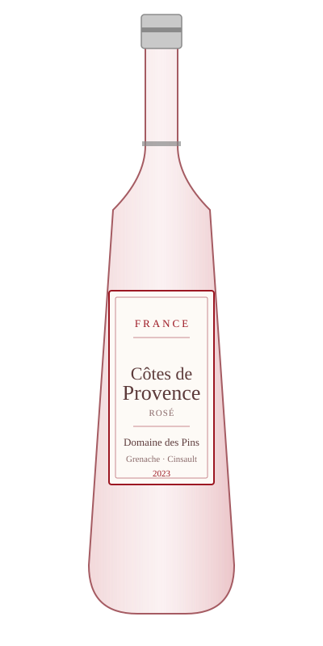

# Côtes de Provence Rosé — Domaine des Pins

<figure markdown>
  { width="280" }
</figure>

## Общая информация

| | |
|---|---|
| **Страна** | Франция |
| **Регион** | Прованс |
| **Апелласьон** | AOC Côtes de Provence |
| **Сорт винограда** | Гренаш, Сенсо, Сира (купаж) |
| **Тип** | Розовое, сухое |
| **Крепость** | 12,5% |
| **Температура подачи** | 8–10 °C |

## Описание

Эталонный прованский розе бледно-лососевого цвета. Аромат свежей клубники, персика, лепестков розы. Вкус лёгкий, сухой, с деликатной кислотностью — совсем не похож на сладкие розовые вина, с которыми его иногда путают.

## Гастрономические пары

- Лёгкие закуски, шарктерия
- Салаты с морепродуктами
- Летние блюда на гриле (овощи, рыба)

!!! tip "На заметку"
    Бледный цвет — не признак "слабого" вина, а сознательный стиль: минимальный контакт сока с кожицей винограда. Гостям, которые ожидают сладкое розе, стоит заранее объяснить, что перед ними сухое вино.
