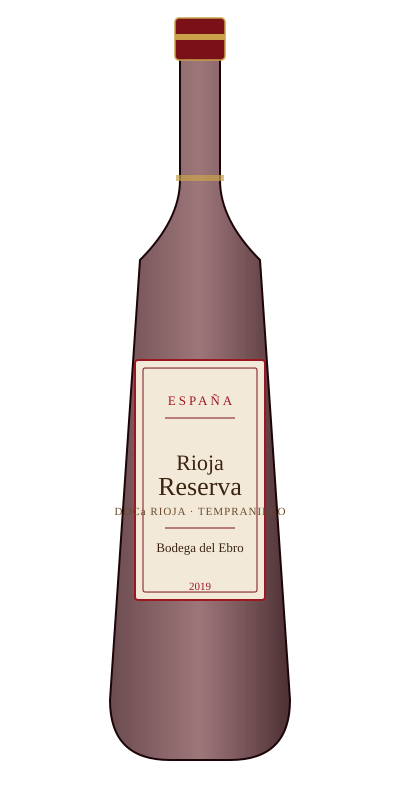

# Rioja Reserva — Bodega del Ebro

<figure markdown>
  { width="280" }
</figure>

## Общая информация

| | |
|---|---|
| **Страна** | Испания |
| **Регион** | Риоха |
| **Апелласьон** | DOCa Rioja, категория Reserva |
| **Сорт винограда** | Темпранильо (100%) |
| **Тип** | Красное, сухое |
| **Крепость** | 13,5% |
| **Температура подачи** | 16–17 °C |
| **Выдержка** | Минимум 1 год в бочке + 2 года всего до продажи (категория Reserva) |

## Описание

Классическая испанская Риоха с выдержкой: вишня, табак, ваниль от американского дуба, лёгкие кожаные тона. Танины мягкие, округлые благодаря длительной выдержке.

## Гастрономические пары

- Тушёная баранина
- Хамон и твёрдые сыры
- Блюда на углях

!!! tip "На заметку"
    Категория на этикетке (Crianza / Reserva / Gran Reserva) — это не просто маркетинг, а точное указание минимальных сроков выдержки по закону. Reserva — минимум 3 года общей выдержки, из них не менее года в бочке.
