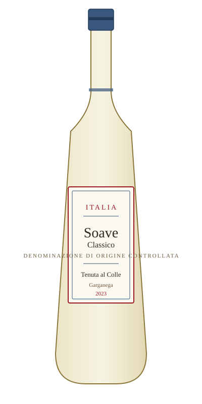

# Soave Classico — Tenuta al Colle

<figure markdown>
  { width="280" }
</figure>

## Общая информация

| | |
|---|---|
| **Страна** | Италия |
| **Регион** | Венето |
| **Апелласьон** | DOC Soave Classico |
| **Сорт винограда** | Гарганега (100%) |
| **Тип** | Белое, сухое |
| **Крепость** | 12,5% |
| **Температура подачи** | 8–10 °C |

## Описание

Соаве Классико — вино из исторической зоны производства на вулканических и известковых холмах Венето. Аромат сочетает белые цветы, миндаль и нотки жёлтого яблока. Вкус лёгкий, освежающий, с приятной лёгкой горчинкой в финале, характерной для сорта гарганега.

## Гастрономические пары

- Ризотто с морепродуктами
- Лёгкая паста с белыми соусами
- Запечённая рыба

!!! tip "История"
    Соаве часто недооценивают из-за истории массового дешёвого экспорта в 1970–80-х. Стоит подчёркивать, что "Classico" в названии означает вино из исторического, наиболее качественного центра апелласьона.

**Из меню:**

- [Капрезе](../menu/salads.md)
